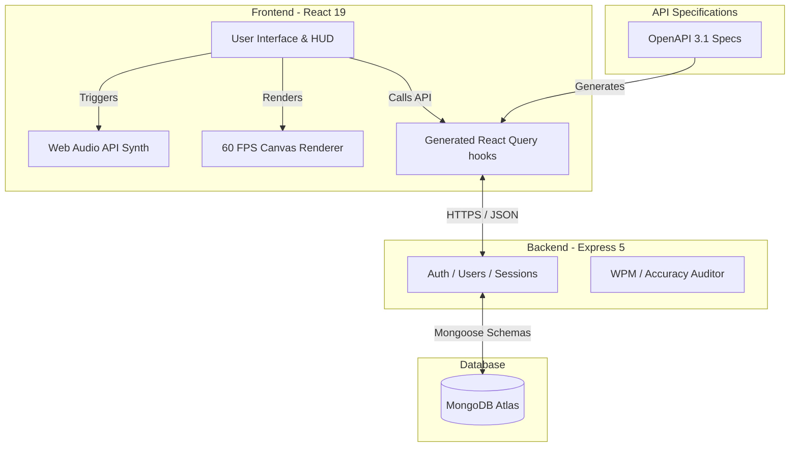

<div align="center">
  
  <br/><br/>
  <h1>⚡ TypeBlitz</h1>
  <h3>The Ultimate Professional Typing Training Platform for Government Exams & Software Engineers</h3>
  <p>
    Train your muscle memory, increase your speed, and achieve 100% typing accuracy with <strong>11 game modes</strong>, <strong>strict level progression</strong>, <strong>pedagogical lessons</strong>, and <strong>deep letter-accuracy heatmaps</strong>.
  </p>

  <br/>

  [](https://www.typescriptlang.org/)
  [](https://react.dev/)
  [](https://vitejs.dev/)
  [](https://expressjs.com/)
  [](https://www.mongodb.com/)
  [](https://www.framer.com/motion/)
  [](https://tailwindcss.com/)

  <br/>

```
 ████████╗██╗   ██╗██████╗ ███████╗██████╗ ██╗     ██╗████████╗███████╗
 ╚══██╔══╝╚██╗ ██╔╝██╔══██╗██╔════╝██╔══██╗██║     ██║╚══██╔══╝╚══███╔╝
    ██║    ╚████╔╝ ██████╔╝█████╗  ██████╔╝██║     ██║   ██║     ███╔╝ 
    ██║     ╚██╔╝  ██╔═══╝ ██╔══╝  ██╔══██╗██║     ██║   ██║    ███╔╝  
    ██║      ██║   ██║     ███████╗██████╔╝███████╗██║   ██║   ███████╗
    ╚═╝      ╚═╝   ╚═╝     ╚══════╝╚═════╝ ╚══════╝╚═╝   ╚═╝   ╚══════╝
```

</div>

---

## 📋 Table of Contents

- [Overview](#-overview)
- [✨ Key Features](#-key-features)
- [🎮 Game Modes](#-game-modes)
- [🔊 Browser-Synthesized Audio System](#-browser-synthesized-audio-system)
- [🎯 HTML5 Canvas 60 FPS Arcade Engine](#-html5-canvas-60-fps-arcade-engine)
- [🏛️ Government Exam Mock Simulator](#-government-exam-mock-simulator)
- [🛠 Tech Stack & Monorepo Structure](#-tech-stack--monorepo-structure)
- [🏗 Architectural Design](#-architectural-design)
- [🚀 Getting Started](#-getting-started)
- [📡 API Reference](#-api-reference)
- [📐 Typing Speed & Accuracy Verification](#-typing-speed--accuracy-verification)
- [🔮 Future Roadmap](#-future-roadmap)
- [📜 License](#-license)

---

## 🌟 Overview

**TypeBlitz** is a full-stack, production-grade typing certification and training platform specifically designed to meet the demands of two competitive fields:
1. **Indian Government Exam Aspirants** preparing for typing tests in **SSC CGL / CHSL, UPSC Civil Services, Banking (IBPS/SBI), Railways (RRB), and Police/Court exams**.
2. **Software Developers & Competitive Typists** aiming to speed up coding workflows by practicing symbols, code keywords, brackets, and real-world script segments.

By bridging arcade gamification with high-fidelity telemetry, TypeBlitz guides users from home-row fundamentals to speed-mastery benchmarks.

---

## ✨ Key Features

### 🔒 Strict WPM & Accuracy Filtering
Unlike generic typing sites that save failed attempts, TypeBlitz implements a **strict 90% accuracy threshold** for high scores. 
- Sessions with **accuracy below 90%** are marked as failed, meaning they **do not** qualify for your personal best, do not advance your levels, and do not appear on the Global Leaderboards.
- This prevents keyspamming cheats and ensures that leaderboard rankings reflect real, high-accuracy typing capability.

### 🎯 Strict Mode (Block on Error)
Toggle **Strict Mode** in the typing arena to instantly block incorrect keystrokes.
- The input indicator will turn red and freeze when a typo is typed.
- You must immediately backspace and type the correct character to proceed.
- Perfect for building absolute muscle memory and mimicking strict government exam typing guidelines.

### 📊 Global Leaderboard & Rank Tracking
- Tracks your **Global Rank** (e.g., `#3`) dynamically across the platform.
- Leaderboard scores are verified server-side.
- Filters by game mode so you can view your standing on individual games or overall.

---

## 🎮 Game Modes

TypeBlitz provides **11 progressive games**, each featuring **5 distinct difficulty levels** (55 levels total).

### Core Practice Modes (7)
| # | Game Mode | Focus Area | Difficulty | Target Words / Snippets |
|---|---|---|---|---|
| 1 | ⚡ **Word Sprint** | Fluency Warmup | Beginner | Common high-frequency English vocabulary |
| 2 | 🏛️ **Govt Exam Sprint** | Govt Exam prep | Intermediate | Legal, administrative, and constitutional terms |
| 3 | 📜 **Sentence Rush** | Punctuation/Shift | Beginner | Punctuation-dense exam-style sentences |
| 4 | 💻 **Code Type** | Coding Syntax | Advanced | Real loops, functions, and TS/JS/Python snippets |
| 5 | 🖥️ **Code Vocab** | Developer Vocab | Intermediate | CS terminology (recursion, middleware, etc.) |
| 6 | 🎯 **Letter Blaster** | Row Drills | Beginner | Key sequences targeting specific rows & symbols |
| 7 | 🏎️ **Typing Race** | Speed Push | Advanced | Long paragraphs requiring high concentration |

### Animated Arcade Modes (4)
| # | Game Mode | Theme | Visual Description |
|---|---|---|---|
| 8 | 🏎️ **Turbo Race** | Speed Racing | Pseudo 3D perspective Canvas racing game. Type to rev up, drift, and overtake. |
| 9 | ⚔️ **Word Fighter** | Arena Combat | 1v1 fighter arena with combat stances, Neon sword slashes, hit particles, and screen shake. |
| 10 | 🧟 **Zombie Hunt** | Survival Shooter | Wave-based shooter where zombies walk towards you; aim rifle, fire bullets, and splat green slime. |
| 11 | 🚀 **Galaxy Blitz** | Space Invaders | Starfighter space battle with vertically scrolling starfields, dual lasers, and alien UFO explosions. |

---

## 🔊 Browser-Synthesized Audio System

TypeBlitz integrates a **low-latency Web Audio API synthesizer** to provide high-fidelity audio feedback without downloading heavy sound assets:
- **Tactile Key Click:** Cherry MX Blue and Brown switches synthesized in real-time.
- **Typing Error Buzzer:** Low-frequency thuds played instantly on mistyped keys.
- **Arcade Action Chimes:** Engine revs, tire screeches, sword slashes, gunshots, splats, laser beams, and explosions.
- **Victory & Defeat Fanfares:** Major/Minor chord sweeps played depending on test success.
- **Global Sound HUD Toggle:** Easily switch sound on/off directly from the game tray.

---

## 🎯 HTML5 Canvas 60 FPS Arcade Engine

All arcade games have been designed using HTML5 `<canvas>` powered by `requestAnimationFrame` for 60 FPS performance:

### 🏎️ Turbo Race
- **Pseudo-3D Projection:** Implements a scrolling segment road curve model using horizontal scanline offsets and relative scale factors:
  $$x' = \frac{x}{z}, \quad y' = \frac{y}{z}$$
- **Engine Synths:** Dynamically adjusts the frequency of an oscillator node based on your active WPM:
  $$f_{\text{engine}} = f_{\text{base}} + (\text{WPM} \times 1.8)\text{ Hz}$$
- **Visuals:** Emits tyre smoke drift particles, exhaust nitro flame bursts during combos, and includes a competitor ghost car whose position moves at a constant target speed.

### ⚔️ Word Fighter
- **Combat Loop:** Features canvas rendering states for both the player and enemy fighters (Idle bobbing, Walk forward, Strike lunges, Knocks, and Stun flashes).
- **Effects:** High-intensity canvas screen-shake upon impact (offsets calculated using random decaying sine waves), glowing circular sword arcs, and floating damage numbers that lift and fade.

### 🧟 Zombie Hunt
- **Aiming Math:** The defender's plasma rifle angle rotates dynamically to match the target zombie coordinate using trigonometry:
  $$\theta = \arctan2(y_{\text{zombie}} - y_{\text{gun}}, x_{\text{zombie}} - x_{\text{gun}})$$
- **Effects:** Gunshots trigger screen recoil shakes, bullets leave neon tracer paths, and dead zombies burst into green splat particles subject to gravity vectors:
  $$y_{t} = y_{t-1} + v_y, \quad v_y = v_y + g$$

### 🚀 Galaxy Blitz
- **Parallax Starfield:** Multiple background star arrays scrolling downwards at rates proportional to their relative sizes to simulate depth.
- **Effects:** Dual neon energy lasers fired from the wings. Alien UFOs disintegrate into firework particle rings using radial coordinate expansion:
  $$x_{\text{particle}} = x_{\text{center}} + r \cos(\phi), \quad y_{\text{particle}} = y_{\text{center}} + r \sin(\phi)$$

---

## 🏛️ Government Exam Mock Simulator

Under the **Govt Exam** tab in the Professional Practice page, users can run authentic skill tests tailored to major recruitment systems:

### 1. SSC CGL / CHSL Typing Test (10 Minutes)
Calculates mistakes based on official guidelines:
- **Full Mistakes:**
  - Omission of a word or figure.
  - Substitution of a word/figure.
  - Addition of a word/figure not in the passage.
- **Half Mistakes:**
  - Spelling errors (additions, omissions, substitutions of letters).
  - Wrong capitalization.
  - Spacing errors (extra space, no space between words).
- **SSC Evaluation Formulae:**
  $$\text{Total Errors} = \text{Full Mistakes} + \frac{\text{Half Mistakes}}{2}$$
  $$\text{Percentage Error} = \frac{\text{Total Errors}}{\text{Total Words in Passage}} \times 100\%$$
  - Uses DP (Depressions) counting where $1 \text{ word} = 5 \text{ key depressions}$.

### 2. Railways NTPC Typing Test (10 Minutes)
- **Error Discounting:** First $5\%$ errors of the total words typed are ignored (discounted).
- **Penalty Weight:** For each additional mistake beyond $5\%$, a penalty of 10 words is deducted from the total words typed.
- **Railways NTPC Formula:**
  $$\text{Penalty Words} = \max\left(0, \text{Total Errors} - \lfloor 0.05 \times \text{Total Words Typed} \rfloor\right) \times 10$$
  $$\text{Net Speed (WPM)} = \frac{\text{Total Words Typed} - \text{Penalty Words}}{\text{Duration (Minutes)}}$$

### 3. Court Typist/High Court Clerk Test (5/10/15 Minutes)
- Demands high accuracy speed with strict thresholds:
  - **Speed Target:** 40 WPM minimum.
  - **Permissible Mistake Limit:** Maximum 3.0% error rate. If exceeded, the assessment fails.

*Copy-paste, context menus, and developer tool intercepts are fully disabled inside the writing pad to match authentic exam settings.*

---

## 🛠 Tech Stack & Monorepo Structure

TypeBlitz is structured as a clean, modular `pnpm` monorepo separating code logic, schema specifications, and client generation.

```
typeblitz/ (Monorepo Root)
├── frontend/                     # React 19 + Vite 7 App
│   ├── src/
│   │   ├── components/           # Custom layout, canvas games, UI components
│   │   ├── pages/                # Home, Dashboard, Games, Play, Leaderboard, Practice
│   │   └── lib/                  # Web Audio system, progress loaders, and helpers
├── backend/                      # Express 5 + Mongoose Server
│   ├── src/
│   │   ├── routes/               # Express endpoints (auth, users, sessions, leaderboards)
│   │   └── models/               # MongoDB models (User, Session, LetterStat)
├── lib/
│   ├── api-spec/                 # OpenAPI 3.1 YAML specifications
│   └── api-client-react/         # Generated React Query hooks (Orval integration)
└── package.json                  # Workspace build, typecheck, and dev scripts
```

---

## 🏗 Architectural Design



---

## 🚀 Getting Started

### Prerequisites
- Node.js 20 or later
- MongoDB Atlas cluster URI (local or cloud-hosted instance)
- pnpm package manager (`npm install -g pnpm`)

### Installation

1. **Clone the repository:**
   ```bash
   git clone https://github.com/yourusername/typeblitz.git
   cd typeblitz
   ```

2. **Install all packages:**
   ```bash
   pnpm install
   ```

3. **Configure environment variables:**
   Create a `.env` file at the root:
   ```env
   MONGODB_URI=mongodb+srv://<username>:<password>@cluster.mongodb.net/typeblitz?retryWrites=true&w=majority
   SESSION_SECRET=your-32-character-hmac-jwt-session-secret-key
   PORT=5000
   ```

4. **Start Development Servers:**
   To run both backend and frontend concurrently in development mode:
   ```bash
   pnpm dev
   ```

5. **Production Build & Launch:**
   To typecheck and build all workspace modules:
   ```bash
   pnpm build
   pnpm start
   ```

---

## 📡 API Reference

The backend exposes a secure REST API documented via OpenAPI:

| Method | Endpoint | Description | Auth Required |
|---|---|---|---|
| `POST` | `/api/auth/register` | Register a new typist account | No |
| `POST` | `/api/auth/login` | Login to typist account | No |
| `POST` | `/api/auth/logout` | Terminate session | Yes |
| `GET` | `/api/auth/me` | Fetch active user credentials & stats | Yes |
| `POST` | `/api/sessions` | Log a finished typing session & audit stats | Yes |
| `GET` | `/api/leaderboard` | Get leaderboard ranking (filtered by game) | No |

---

## 📐 Typing Speed & Accuracy Verification

TypeBlitz uses the official **international typing speed standards**:

### Words Per Minute (WPM) Formula
$$WPM = \frac{\text{Correct Characters} / 5}{\text{Minutes Elapsed}}$$

### Real-Time Keystroke Accuracy Formula
$$\text{Accuracy (\%)} = \max\left(0, \frac{\text{Total Keystrokes} - \text{Error Keystrokes}}{\text{Total Keystrokes}} \times 100\right)$$

- Keystroke errors are tracked in real-time and persist even if the user corrects them using backspaces. This blocks accuracy keyspamming cheats.

---

## 🔮 Future Roadmap

- [x] **HTML5 Canvas Arcade Engine:** 60 FPS visual overhaul for arcade games.
- [x] **Browser Sound Synthesis:** low-latency asset-free Web Audio feedback.
- [x] **Govt Mock Simulator:** Official SSC/Railways NTPC rules and evaluation cards.
- [x] **Page Lazy Loading:** React.lazy chunks for lightning-fast routing.
- [ ] **Multiplayer Arena:** Real-time WebSockets race tracks.
- [ ] **Typing Certificate:** Export PDF certificates for WPM speed milestones.

---

## 📜 License

TypeBlitz is open-source software licensed under the [MIT License](LICENSE).
